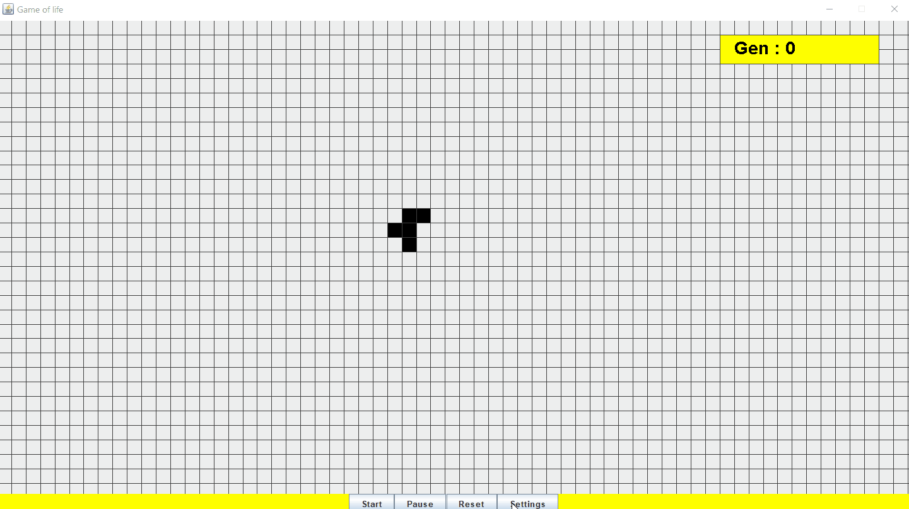

# Game-of-Life
A fun simulation game based on the rules of John Conway's Game of Life

## Installation
The only actual dependency required for running this simulation game is a java (jdk and jre) version of 1.9 or higher that you can get from [here]( https://www.oracle.com/java/technologies/javase/javase9-archive-downloads.html). Then if you simply want to play the game run the jar file.

## Description
Game of Life is a zero-player based game in which cells “evolve” by moving through space giving birth to new generations and fading away at the same time simulating the behavior of a life form. The behavior of the cells is based of a set of rules that you can find [on wikipedia](https://en.wikipedia.org/wiki/Conway%27s_Game_of_Life) alongside other interesting information about the game.
My implementation consists of a fixed board on which a user can give a start configuration and control the behavior of the simulation by starting, pausing, and resetting it. Also, by accessing the settings button a user can modify the looks of the window and the speed of cells’ evolution.

## Roadmap
As future development, an interesting idea would be to make the board scalable so that the player could observe what happens when the cells travel outside of the visible bounding box.

## Contributing
I am open to contributions, if you want to implement some cool features in this application, please feel free to make a pull request.

## License
This project is licensed under [MIT](https://choosealicense.com/licenses/mit/)
